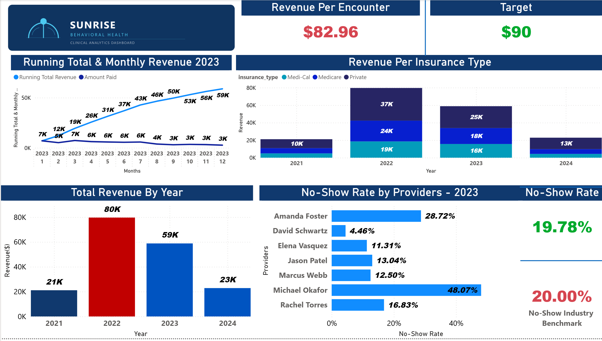
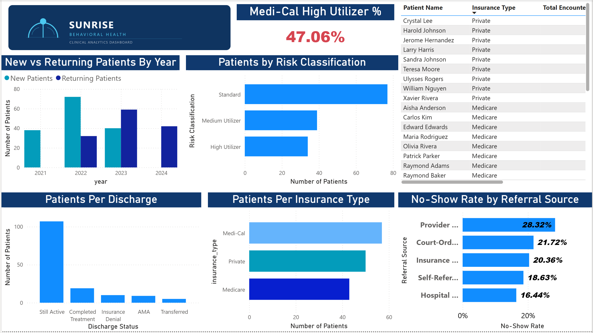
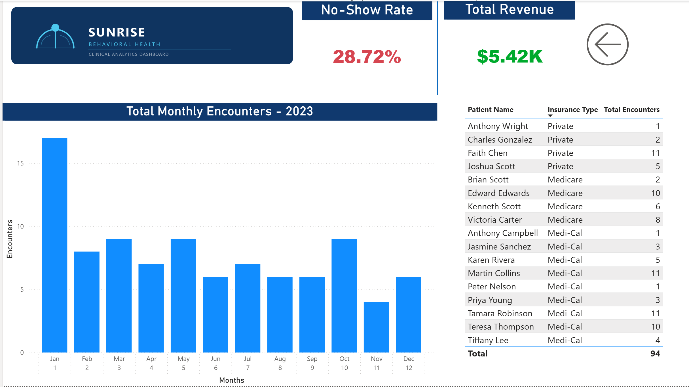

# Sunrise Behavioral Health Clinic — Power BI Executive Dashboard

## Overview

This project is the direct visual continuation of [Portfolio Project 1 — Behavioral Health SQL Analytics](https://github.com/bridgyjake/sunrise-behavioral-health-analytics). Every finding surfaced through SQL in Project 1 is now visualized as an interactive, multi-page executive dashboard built in Power BI Desktop, connected directly to a live MySQL database.

The goal was to translate complex analytical findings into a format a clinic director could act on immediately — without needing to read a single SQL query.

This dashboard was redesigned in v2 to consolidate five pages into three, apply consistent professional branding, and improve visual clarity across all pages.

---

## The Business Problems This Dashboard Answers

These are the same five questions established in Project 1, now answered visually:

1. **What drove the revenue decline between 2022 and 2023?** → Page 1 (Clinic Overview) — revenue by year with conditional coloring highlighting the 2022 peak and 2023 decline, payer mix shift by year, and running total showing the second-half revenue collapse

2. **Which providers are performing efficiently, and which represent operational risk?** → Page 1 (Clinic Overview) — no-show rate by provider benchmarked against the clinic average, with drill-through to Page 3 (Provider Detail) for individual provider deep-dives

3. **Are patients being retained year-over-year, or is the clinic losing its existing base?** → Page 2 (Patient & Risk Analysis) — new vs. returning patients by year, showing the retention trend from 2021 to 2024

4. **What is driving patient discharges — clinical completion or external factors like insurance denial?** → Page 2 (Patient & Risk Analysis) — discharge reason breakdown showing insurance denial as the second leading discharge cause

5. **Which patient populations represent the highest utilization and financial risk?** → Page 2 (Patient & Risk Analysis) — high utilizer identification, risk classification distribution, and Medi-Cal concentration among high utilizers

---

## Dashboard Structure

| Page | Title | Key Visuals |
|------|-------|-------------|
| 1 | Clinic Overview | Revenue by year, running total & monthly revenue (2023), revenue by insurance type by year, revenue per encounter vs target, no-show rate by provider vs benchmark |
| 2 | Patient & Risk Analysis | New vs returning patients by year, patients by risk classification, patients per discharge reason, patients per insurance type, no-show rate by referral source, Medi-Cal high utilizer %, high utilizer patient table |
| 3 | Provider Detail | Drill-through page — no-show rate, total revenue, total monthly encounters, full patient list with insurance types for any individual provider |

---

## v2 Redesign — What Changed and Why

**Consolidated from 5 pages to 3**
The original dashboard had separate pages for Clinic Overview, Patient Analysis, Patient Risk & Utilization, Financial Trends, and Provider Detail. Financial Trends visuals were merged into Clinic Overview so all revenue and operational data lives in one executive view. Patient Analysis and Patient Risk & Utilization were merged into one Patient & Risk Analysis page so all patient-facing analysis is in one place. This mirrors how clinic leadership actually consumes data — they want one operational page and one patient page, not five separate tabs.

**Professional branding applied**
A custom Sunrise Behavioral Health logo was added to every page header. The navy (#0f3460) and cyan (#4CC9F0) color palette was applied consistently across all pages, replacing the default Power BI color scheme.

**Conditional coloring on revenue chart**
The Total Revenue by Year chart now uses conditional coloring — 2022 (peak year) is highlighted in red so the revenue decline story is immediately visible without reading the numbers.

**No-show rate formatting fixed**
The provider no-show rate bar chart was previously displaying values in K% format. This was corrected to display as proper percentages (28.72%, 4.46%, etc.).

---

## Page Screenshots

### Page 1 — Clinic Overview


### Page 2 — Patient & Risk Analysis


### Page 3 — Provider Detail (Drill-Through)


---

## Connection to Project 1

This dashboard was built directly on top of the data architecture established in Project 1:

- **Data source:** MySQL database (`sunrise_bh_v4`) connected live to Power BI Desktop via MySQL Connector/NET
- **Tables used:** `stg_patients`, `stg_encounters`, `stg_billing`, `providers`, `diagnoses`, and `patient_retention` (imported from SQL query result)
- **Staging layer:** All visuals pull from the cleaned staging tables built in Project 1. The raw data layer remains untouched, preserving auditability of the original 50 data quality issues documented in Project 1.
- **Narrative continuity:** Every visual in this dashboard corresponds to a specific SQL query and finding from Project 1. The SQL findings validated the dashboard; the dashboard makes the SQL findings accessible to a non-technical audience.

---

## Technical Skills Demonstrated

**Power BI Desktop:**
- Direct MySQL database connection (via MySQL Connector/NET)
- Data model relationships across 6 tables
- 3-page report with cross-filtering and cross-highlighting between visuals
- Drill-through page (Provider Detail) configured on Provider Name field
- Custom branding with logo header and consistent color palette across all pages

**DAX Measures and Calculated Columns:**

```dax
-- No-Show Rate (dynamic measure, responds to all page filters)
No-Show Rate =
DIVIDE(
    CALCULATE(COUNTROWS(stg_encounters), stg_encounters[show_status] = "No Show"),
    COUNTROWS(stg_encounters)
)

-- Revenue Per Encounter
Revenue Per Encounter =
DIVIDE(SUM(stg_billing[amount_paid]), COUNTROWS(stg_encounters))

-- Running Total Revenue
Running Total Revenue =
VAR CurrentMonth = MAX(stg_encounters[Month Number])
RETURN
CALCULATE(
    SUM(stg_billing[amount_paid]),
    FILTER(
        ALL(stg_encounters[Month Number]),
        stg_encounters[Month Number] <= CurrentMonth
    )
)

-- Provider Name (calculated column)
Provider Name = providers[first_name] & " " & providers[last_name]

-- Patient Name (calculated column)
Patient Name = stg_patients[first_name] & " " & stg_patients[last_name]

-- Discharge Status (NULL handling)
Discharge Status =
IF(ISBLANK(stg_patients[discharge_reason]), "Still Active", stg_patients[discharge_reason])

-- Risk Classification (calculated column)
Risk Classification =
VAR EncounterCount = CALCULATE(COUNTROWS(stg_encounters))
RETURN
IF(EncounterCount > 20, "High Utilizer",
    IF(EncounterCount > 13, "Medium Utilizer", "Standard"))

-- Medi-Cal High Utilizer %
Medi-Cal High Utilizer % =
DIVIDE(
    CALCULATE(
        COUNTROWS(stg_patients),
        stg_patients[Risk Classification] = "High Utilizer",
        stg_patients[insurance_type] = "Medi-Cal"
    ),
    CALCULATE(
        COUNTROWS(stg_patients),
        stg_patients[Risk Classification] = "High Utilizer"
    )
)

-- Benchmark targets
No-Show Target = 0.20
Revenue Per Encounter Target = 90
```

**Design Decisions:**
- Conditional color coding on revenue by year chart — 2022 peak highlighted so the decline narrative is immediately visible
- Consistent navy/cyan palette across all pages replacing default Power BI colors
- KPI cards paired with industry benchmark targets for context
- Drill-through page built on Provider Name field — right-click any provider on Page 1 and navigate directly to their full performance profile
- Patient retention data imported from SQL query result rather than DAX — complex cohort logic belongs in the data layer, not the visualization layer

---

## Key Findings

**1. Revenue peaked in 2022 and declined 26% in 2023**
Clinic revenue fell from $80K in 2022 to $59K in 2023. The running total chart shows the decline accelerated in the second half of 2023 — the running total flattens sharply after June, confirming the back half of the year generated roughly half the monthly revenue of the front half.

**2. Private insurance revenue declined the most in absolute dollars**
The stacked revenue chart shows Private insurance shrinking as a share of total revenue from 2022 to 2023. Since Private pays the most per encounter, losing Private patients has an outsized financial impact beyond what encounter volume alone would suggest.

**3. Michael Okafor represents the clinic's most significant operational risk**
At 48.07% no-show rate — more than double the clinic average of 19.78% and nearly 11x David Schwartz's 4.46% — Okafor's performance warrants immediate intervention. Drill-through to his Provider Detail page reveals his patient panel skews heavily toward Medi-Cal, explaining both the low revenue per encounter and the high no-show rate.

**4. Insurance Denial is the second leading discharge reason**
Of 43 discharged patients, 10 (23.3%) left due to insurance denial — not clinical completion. This is a preventable discharge type that represents both a clinical failure and a financial one.

**5. 47.06% of high utilizers are Medi-Cal patients**
The clinic's most resource-intensive patients are disproportionately its least financially sustainable. This structural imbalance between utilization and reimbursement is a long-term sustainability risk.

**6. Hospital Discharge referrals have the lowest no-show rate (16.44%)**
Patients referred from a hospital discharge are more engaged than any other referral channel. Provider Referrals have the highest no-show rate (28.32%).

---

## Recommendations

**1. Implement provider-specific no-show intervention for Michael Okafor**
A 48% no-show rate is not sustainable. Recommended actions: appointment reminder protocols (SMS/call 24-48 hours before), review of scheduling practices, and care coordinator outreach for patients who miss two consecutive appointments. Target: reduce to below the 20% clinic benchmark within 6 months.

**2. Review medical necessity documentation practices for Medi-Cal and Medicare patients**
10 insurance denial discharges represents a 23.3% preventable discharge rate. Standardizing clinical documentation templates aligned to payer-specific medical necessity criteria, combined with a systematic appeals process, could recover a meaningful portion of these patients.

**3. Develop a referral source-differentiated intake protocol**
Since Hospital Discharge patients show the lowest no-show rate (16.44%) and Provider Referral the highest (28.32%), intake coordinators should implement enhanced engagement protocols for Provider Referral patients specifically.

**4. Address Private insurance patient attrition before 2024**
The payer mix data shows Private insurance declining as a share of revenue from 2022 to 2023. Retaining or growing the Private insurance patient base has an outsized financial return since Private pays significantly more per encounter.

**5. Implement care coordination for the 34 identified high utilizers**
High utilizers (>20 encounters) account for a disproportionate share of clinical resources. Proactive care coordination can both improve clinical outcomes and reduce the cost-revenue imbalance identified in the analysis.

---

## File Availability and Publishing Constraints

This dashboard was built in Power BI Desktop connected to a local MySQL database. Publishing to Power BI Service for a public interactive link requires an organizational Microsoft 365 account — a constraint common in healthcare environments where IT departments restrict self-service cloud publishing for HIPAA compliance reasons.

This project is shared in two formats:

- **`Sunrise_Behavioral_Health_Dashboard.pbix`** — The full Power BI project file. Download and open in Power BI Desktop (free) to interact with the live dashboard, explore DAX measures, and review the data model.
- **`sunrise_behavioral_health_report.pdf`** — All 3 pages exported as a static PDF.

---

## HIPAA Note

This project uses entirely synthetic data generated to mirror realistic behavioral health EMR structures. No real patient data was used. In a production environment, all patient PII would be replaced with de-identified patient IDs per HIPAA Safe Harbor guidelines prior to any analytical query or visualization.

---

## Project Connections

| Project | Description | Link |
|---------|-------------|------|
| Project 1 | End-to-end SQL analytics — data validation, staging architecture, 13 analytical queries | [GitHub]([https://github.com/bridgyjake/sunrise-behavioral-health-analytics](https://github.com/bridgyjake/sunrise-behavioral-health-analytics)) |
| Project 2 | This project — Power BI executive dashboard | Current repo |
| Project 3 | Python + dbt/Databricks data pipeline (coming soon) | — |

---

## About

Built by Jakob Bridgman — behavioral health worker with over 3 years of direct clinical experience transitioning into healthcare data analytics and data engineering. This project reflects both technical Power BI and DAX proficiency and domain-level understanding of behavioral health operations, payer dynamics, and clinical outcome metrics.

*Targeting Healthcare Data Analyst, Clinical Data Analyst, and Epic Clarity Analyst roles. Open to connecting on LinkedIn
https://www.linkedin.com/in/jakob-bridgman-514615397/
